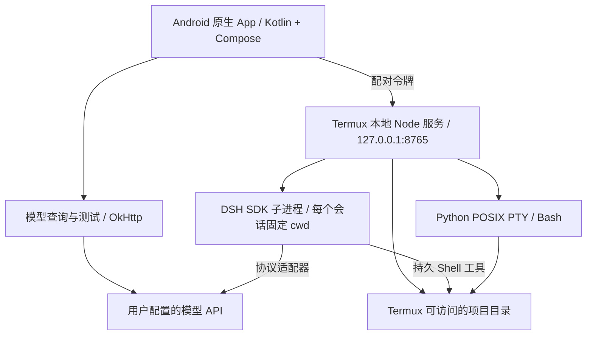

# DSH Pocket

**在 Android 上使用完整 Termux 环境的原生 AI 编程助手。**

DSH Pocket 将 Kotlin / Jetpack Compose 界面、手机本地执行服务和适配 Android arm64 的 [DeepSeek Harness](https://github.com/deepseek-ai/deepseek-harness) 连接起来。可以在聊天中让模型操作项目，也可以直接打开终端，执行命令、安装工具、编译代码。

当前版本：**0.4.4-dev，开发预览版**。项目使用手机已安装的 Termux，工作区文件保留原位置，无需导入 App 私有目录。本项目与 DeepSeek 官方 Android App、Termux 官方项目无隶属关系。

## 目录

- [功能与当前状态](#功能与当前状态)
- [架构与执行方式](#架构与执行方式)
- [运行要求](#运行要求)
- [手机首次安装](#手机首次安装)
- [自定义 API 和多个预设](#自定义-api-和多个预设)
- [工作区与终端](#工作区与终端)
- [从源码构建](#从源码构建)
- [测试与验证](#测试与验证)
- [Android arm64 适配](#android-arm64-适配)
- [数据存储与权限](#数据存储与权限)
- [升级与故障排查](#升级与故障排查)
- [已知限制与后续方向](#已知限制与后续方向)
- [项目结构](#项目结构)
- [第三方项目与许可证](#第三方项目与许可证)

## 功能与当前状态

| 功能 | 当前实现 |
| --- | --- |
| 原生聊天界面 | Compose 实现聊天、导航、模型设置和工具活动查看 |
| DSH 编程代理 | 运行真实 DSH SDK，可通过持久 Shell 修改文件和执行命令 |
| 多工作区 | 注册 Termux 有权限访问的绝对路径，直接操作原始目录 |
| 文件浏览 | 浏览目录、创建目录、预览文本文件 |
| 交互终端 | Python POSIX PTY + 本地 xterm.js，支持输入、尺寸变化和持续 Shell 状态 |
| 自定义 API | OpenAI Chat Completions、OpenAI Responses、DeepSeek Messages |
| 多连接预设 | 保存、切换、删除多组端点、Key、协议和模型 |
| 模型查询与测试 | 查询端点模型列表；对所选模型发送一次简短生成请求 |
| 地址补全 | 支持基础地址或完整请求地址，自动处理协议后缀 |
| 密钥存储 | Android Keystore + AES-GCM 加密保存 API 配置 |
| 会话记录 | 保存聊天和工具活动，重启后的旧会话可查看 |
| 星标与删除 | 工作区和对话均可置顶星标、随时删除；删除对话不触碰项目文件 |
| 实时推送 | 会话事件经 SSE 推送；不可用时自动退回按修订号的增量轮询 |
| 断点续用 | 停止后的会话可以继续提问，无需新建；损坏的记录会被隔离而不是让服务起不来 |
| 模型能力 | 每个 API 预设可设置上下文长度与单次输出上限 |

已验证的关键链路：

- Android arm64 真机上安装 DSH `0.2.0-rc.2`，通过文件锁、原子发布、node-pty 和 SDK 初始化检查。
- 真机终端可输入并执行命令，PTY 行列数与显示区域同步。
- **真实 DSH + 本地模拟 OpenAI API** 完成完整工具调用：模型返回 Bash 调用，DSH 在真实 Termux 目录写入并读取文件，再返回助手消息。
- 桌面回归覆盖多工作区、会话回执竞争、停止、认证、凭据切换、适配器配置和端点补全。
- APK 构建和 Android Lint 检查通过。
- Android 原生检查已在真机通过：端点处理、模型查询、三种协议请求、401 脱敏、多预设加密保存及当前预设恢复。

模拟 API 测试不使用真实供应商 Key。第三方服务的模型权限、计费和工具调用兼容性，仍需用实际端点验证。

## 架构与执行方式



App 通过 Termux 的 `RUN_COMMAND` 接口启动服务。本地服务管理工作区、文件、聊天和终端，使用 JSON-RPC 与 DSH 的 `sdk-minimal` 运行配置交互。

聊天、文件和设置页面使用原生 Compose；终端显示使用 APK 内附的 xterm.js。终端 WebView 禁止加载外部网络资源，不依赖 CDN。

连接测试直接由 Android 发起，不要求 DSH 已安装。实际编程对话由 Termux 中的 DSH 发起，因此 Android App 与 Termux 的代理、网络和后台策略可能影响各自的请求结果。

## 运行要求

### 手机

| 项目 | 要求 |
| --- | --- |
| Android | App 最低 Android 8.0 / API 26；目前真机测试环境为 Android 16 |
| CPU | DSH 安装器目前仅支持 Android arm64 / aarch64 |
| Termux | 标准包名 `com.termux`，已打开并初始化 |
| Node.js | 安装器要求 22.19+ 或 24+；实际验证版本为 24.18.0 |
| Python | 用于 PTY 服务和部分原生依赖构建 |
| 网络 | 首次下载依赖及访问模型 API 时需要 |

安装器会检查或安装 `python`、`clang`、`make`、`cmake`、`pkg-config`、`git`、`ripgrep`、`ndk-sysroot`、`libandroid-spawn` 等依赖。首次安装包含 npm 下载和原生模块编译，需要等待 Termux 中的安装进度完成。

### 构建电脑

- JDK 17。
- Android SDK Platform 35、Build Tools 和 Platform Tools。
- Node.js 22+，建议 Node.js 24。
- Git。
- Windows 构建脚本使用 PowerShell；仓库已包含 Gradle Wrapper。

## 手机首次安装

### 1. 准备 Termux

安装并打开 [Termux](https://github.com/termux/termux-app)，执行：

```sh
mkdir -p ~/.termux
printf '\nallow-external-apps=true\n' >> ~/.termux/termux.properties
termux-reload-settings
pkg install -y nodejs-lts python
mkdir -p ~/projects/pocket-a ~/projects/pocket-b
```

`allow-external-apps=true` 允许已获得运行命令权限的外部应用调用 Termux。App 环境页也提供复制配置命令的入口。

### 2. 安装 APK 并连接

从源码构建后安装 APK。USB 调试已连接时可以执行：

```sh
adb install -r app/build/outputs/apk/debug/app-debug.apk
```

打开 DSH Pocket → **环境**：

1. 点击 **授予权限**，允许在 Termux 中运行命令。
2. 确认上面的外部应用配置已执行。
3. 点击 **启动本地服务**。
4. 顶部应显示 **本地已连接 · Termux**。

### 3. 安装 Android 引擎

点击 **环境 → 安装 / 检查 Android 引擎**。App 会打开 Termux，依次检查依赖、下载固定版本、应用 Android 补丁、编译原生模块、生成启动器、运行自检。

成功时显示：

```text
DSH engine is ready. Return to DSH Pocket and refresh the environment.
```

完整日志位于：

```text
~/.local/share/dsh-pocket/install.log
```

返回 App 刷新状态，应显示 **已发现 DSH · SDK 模式**。只有原生依赖和 SDK 检查通过，安装器才会写入就绪标记。

### 4. 开始编程对话

保存 API 预设，选择工作区并新建会话。勾选允许执行命令和修改文件后发送任务，例如：

```text
在当前目录创建 hello.py，打印 Hello from Android，然后运行它并说明结果。
```

此授权适用于整个会话。DSH 进程拥有 Termux 自身的权限，工作区不是操作系统级执行沙箱。

## 自定义 API 和多个预设

入口：**环境 → API 连接预设**。

1. 点击 **新增预设**，填写名称。
2. 选择协议，输入端点和 API Key。
3. 点击 **查询模型**，从列表选择模型，也可手动填写模型 ID。
4. 点击 **测试所选模型**，验证一次实际生成请求。
5. 点击 **保存并启用预设**。
6. 回到对话页，新建会话使用该连接。

密钥在输入框中隐藏，保存内容使用 Android Keystore 加密。升级时，旧版单连接配置会迁移为“原有连接”。

### 选择协议

| 协议 | 请求路径 | 适用情形 |
| --- | --- | --- |
| OpenAI Chat Completions | `{base}/chat/completions` | 常见 OpenAI 兼容网关和代理 |
| OpenAI Responses | `{base}/responses` | 明确支持 Responses API 的端点 |
| DeepSeek Messages | `{root}/v1/messages` | DeepSeek Messages 接口，默认基础地址为 `https://api.deepseek.com/anthropic` |

协议由服务端的 API 格式决定，与模型名称中的 DeepSeek、GPT、Gemini 等品牌名称不是同一件事。通过 OpenAI 兼容网关使用其他模型时，通常应选 Chat Completions。

App 自动配置 DSH Provider，不需要手填内部名称。自定义 OpenAI 请求使用上游 `@deepseek-ai/dsh-llm-pi-ai`，DeepSeek Messages 使用其官方适配器。

### 后缀补全规则

以 Chat Completions 为例：

| 填写地址 | 最终生成请求地址 |
| --- | --- |
| `https://api.example.com` | `https://api.example.com/v1/chat/completions` |
| `https://api.example.com/v1` | `https://api.example.com/v1/chat/completions` |
| `https://api.example.com/v1/chat/completions` | 保留完整请求路径，不重复追加 |
| `https://api.example.com/custom/api` | `https://api.example.com/custom/api/chat/completions` |
| `https://api.example.com/chat/completions` | 保留完整路径，不额外插入 `/v1` |

“仅填域名时补 `/v1`”可以关闭。已有自定义路径会被保留，程序不会猜测其后是否还需要 `/v1`。界面会显示**实际请求地址**，可直接核对。

支持 HTTP 和 HTTPS。远程服务宜用 HTTPS；HTTP 可用于明确配置的本机或局域网端点。URL 不接受用户名、密码、查询参数或片段，Key 应填入独立字段。

### 模型列表与可用性

- 查询模型通常请求 `{base}/models`；DeepSeek 官方 Messages 连接使用其官方模型列表地址。
- 返回列表不代表当前 Key 可以调用其中所有模型，应选择后测试。
- 测试会发送简短生成请求，可能消耗少量 API 额度。
- 网关没有模型列表接口时，可手动填写模型 ID 后测试。
- 生成请求成功不代表工具调用一定兼容；DSH 编程对话还需要相应的流式响应和工具调用支持。
- 修改 Key、端点、协议或模型后需要新建会话。旧进程不会静默切换凭据。

## 工作区与终端

### 使用不同目录

通过工作区入口注册真实绝对路径，例如：

```text
/data/data/com.termux/files/home/projects/pocket-a
/data/data/com.termux/files/home/projects/pocket-b
/sdcard/Download/my-project
```

目录无需位于 DSH Pocket 安装文件夹中。App 只记录其位置，项目文件仍保存在原处。

实际访问范围由 Android 和 Termux 权限决定：

- Termux HOME 适合 Git、编译、符号链接和可执行文件。
- 共享存储可先在 Termux 执行 `termux-setup-storage` 并授予权限。
- 普通 Termux 无法访问其他 App 的私有目录。
- 共享存储的执行位和符号链接行为不同，复杂构建建议放在 HOME。

### 外接 SD 卡 / USB 硬盘

在「添加工作区」中点「刷新存储」。快捷入口只保留三个：`主目录`、`内部存储` 和 `外接存储 · 卷标`（卷标来自 Android 的可移动存储列表，或 `/storage` 下真实存在的挂载卷）。也可以直接输入 `/storage/XXXX-XXXX/projects` 或 `~/storage/external-1/projects`。目录链接可正常浏览，不必把项目复制进 App。

1. 先在 Termux 执行 `termux-setup-storage`，授权后返回刷新。插拔存储后也请刷新。
2. 「在此新建文件夹」使用输入框里的目录作为父目录；新建后可打开子目录。
3. 「验证读写」会创建、写入、读取并删除一个随机命名的小文件。保存工作区时也会验证，失败不会保存无效项目。
4. 外接盘根目录若不可写，尝试 `~/storage/external-1`。它通常指向卡上的 `Android/data/com.termux/files`，并非卡根目录；卸载 Termux 可能删除其中的数据。
5. 如果所用 Termux 声明了「所有文件访问」权限，按钮可打开它的系统授权页；是否授予由用户决定。普通版本没有该权限时会打开应用设置，不会绕过 Android 限制。

本应用通过 Termux 的真实文件路径执行命令。Android 文档选择器的 `content://` 授权不能自动转换成 Termux 的目录权限。未挂载、只读、权限不足的存储会报告具体错误。外接文件系统可能不支持执行位、符号链接或直接运行二进制；可在盘上编辑源码、运行 Python 等解释器，复杂构建的缓存和可执行产物建议放在 Termux HOME。

参考：[Android 目录授权](https://developer.android.com/training/data-storage/shared/documents-files)、[Termux 存储说明](https://github.com/termux/termux-tools/blob/master/doc/termux.1.md.in)。

### 单一 App、签名与升级

项目只构建一个 App：包名 `dev.dsh.pocket`，显示名「DSH Pocket」，本地服务使用端口 8765 和 `~/.local/share/dsh-pocket`。

所有构建都固定使用仓库内的 `.cache/debug.keystore`（`CN=Android Debug`，SHA-256 `04:1A:95:…:ED:77`），所以同一台机器上重新构建的 APK 可以直接覆盖安装。

Android 只允许同一签名的 APK 覆盖安装。若平板上已有的安装来自另一把密钥（例如更早用其它 debug keystore 构建的版本），会报 `INSTALL_FAILED_UPDATE_INCOMPATIBLE`，只能先卸载旧 App 再安装。卸载不会删除 Termux 里的数据：引擎、聊天和工作区都在 `~/.local/share/dsh-pocket`，重新连接后仍然可用，只有 App 私有保存的 API Key 需要重新填写一次。

### 终端状态与 AI 工作区

同一终端会话保留 `cd` 和 Shell 变量：

```sh
cd ~/projects/pocket-a
POCKET_TEST=hello
cd ../pocket-b
printf '%s\n' "$POCKET_TEST"
pwd
```

终端中的 `cd` 只影响该终端。AI 工作区通过 App 单独选择，每个 DSH 会话启动时固定 `cwd`。让 AI 操作其他项目时，应切换工作区并新建会话。

终端底部提供 Esc、Tab、Ctrl+C 和方向键。环境页也可打开原生 Termux 终端，继续使用原有工具和配置。

### 打开与编辑文件

文件页点一个文件就会打开全屏查看器，不再只是一个只读弹窗：

- **代码 / 文本**（c、h、cpp、py、java、kt、js、ts、json、yaml、toml、xml、html、css、sql、sh、md、gradle…）：行内语法高亮，可直接编辑，右上角保存。保存是原子写入（先写临时文件再改名），权限位保持不变。保存键右边还有一个 ▶「在终端运行」：跳到该文件目录并执行（py→python3、sh→bash、js→node、rb/php/lua/pl 同理）。
- **图片**（png、jpg、webp、gif、bmp、heic）：可双指缩放、拖动，大图按屏幕尺寸采样解码，不会把 12 MP 原图整份读进内存。
- **PDF**：内置分页查看器，左右翻页，底部有 缩小 / 放大 / 百分比复位，也可双指缩放拖动。
- **压缩包**（zip、jar、apk、docx、xlsx…）：列出条目与大小，右上角「解压到此处」就地解压到同名文件夹；解压失败会清理干净，并且拒绝 .. 这类越界路径。
- **二进制**：十六进制查看器（偏移 / 十六进制 / ASCII），显示开头 64 KB，够用来认文件又不会把内存吃满。
- **其它格式**：右上角「更多」→「用其他应用打开」，交给系统里装了对应 App 的那一个。

几个刻意的设计：

1. **GBK 文本照常显示**。Termux 里的中文源码常是 GBK，按 UTF-8 解码会全是乱码；桥接会先严格试 UTF-8，失败再用 GBK。Node 没有 GBK 编码器，所以 GBK 文件默认只读，点「转为 UTF-8 编辑」才会写回——中文内容不变，编码变成 UTF-8。
2. **外部修改不会静默覆盖**。打开文件时记下 mtime，保存前再比一次；如果 DSH 在终端里改过这个文件，会提示「文件已被外部修改」，让你选择是否覆盖。
3. **「在终端打开」**：查看器右上角菜单可直接跳到该文件所在目录。已有终端会执行一次 `cd`（保留历史），没有则在那个目录新开一个。
4. **查找**（右上角 ⋮ → 查找）：全文高亮所有匹配，当前项用更深的底色，显示「当前 / 总数」并提供 上一个 / 下一个。
5. 「用其他应用打开」只通过 FileProvider 暴露 App 自己缓存的副本；Termux 工作区本身从未对外开放。
### 继续上次的对话

上次运行留下的对话现在可以直接接着问：DSH 引擎把会话持久化在 DSH_HOME，所以桥接收提问时会把归档的
会话恢复成可运行状态，引擎自己接上历史，而不是让你去侧栏新建一个。

### 中文 / English

界面跟随系统语言：系统是中文时显示中文，其它语言回落到英文。桥接的错误信息也跟随同一语言——
App 在请求里带上 `Accept-Language`，Termux 侧按它选择措辞（没有这个头时默认中文，方便 curl 和测试）。

文本放在两处：App 的 [Lang.kt](app/src/main/java/dev/dsh/pocket/Lang.kt) 以中文原文为键、英文为值；
桥接的 [i18n.mjs](bridge/i18n.mjs) 同理，并用 `AsyncLocalStorage` 让语言按请求隔离。
任何没有翻译的字符串都会原样显示中文，不会出现占位符或空白。

## 从源码构建

### Windows / PowerShell

配置 JDK 17、Android SDK 以及 `JAVA_HOME` / `ANDROID_HOME`，在仓库根目录执行：

```powershell
.\scripts\build.ps1
```

脚本运行 `assembleDebug` 和 `lintDebug`，首次构建会生成本机 debug 签名。已有依赖缓存时：

```powershell
.\scripts\build.ps1 -Offline
```

输出：

```text
app/build/outputs/apk/debug/app-debug.apk
app/build/reports/lint-results-debug.html
```

SDK 不在默认位置时，可以在未提交的 `local.properties` 中设置 `sdk.dir`。

### 直接使用 Gradle

当前使用 Gradle 8.13、Android Gradle Plugin 8.11.1、Kotlin 2.0.21、compileSdk / targetSdk 35、minSdk 26。

其他桌面系统配置好 JDK 和 SDK 后，可以准备 debug 签名并运行：

```sh
mkdir -p .cache
keytool -genkeypair -noprompt -keystore .cache/debug.keystore \
  -storepass android -keypass android -alias androiddebugkey \
  -dname 'CN=Android Debug,O=Android,C=US' \
  -keyalg RSA -keysize 2048 -validity 10000
bash ./gradlew --no-daemon :app:assembleDebug :app:lintDebug
```

已有 `.cache/debug.keystore` 时跳过生成步骤。不同电脑的 debug 签名可能不同，不能保证相互覆盖安装。正式发布需要单独配置 release 签名。

### 终端资源

xterm.js 和 fit 插件已附带，无需运行时下载。重新生成固定版本资源：

```sh
node scripts/prepare-assets.mjs
```

脚本从 npm 下载并校验 SHA-512 integrity，来源记录在 `app/src/main/assets/terminal/dependencies.json`。

## 测试与验证

### 桌面回归

```sh
node --expose-internals --test tests/*.test.mjs
```

覆盖认证、浏览器 Origin 拒绝、多工作区、文件预览边界、SDK 回执竞争、连续会话、停止进程、端点补全、适配器配置、凭据切换和终端布局。

Windows 没有 POSIX PTY，因此真实 PTY 测试会跳过。该项应在 Termux 或其他 POSIX 系统验证。子进程受限时，可单独运行：

```sh
node --test --test-isolation=none tests/providers.test.mjs tests/terminal-layout.test.mjs
```

### 安装自检

`termux/smoke.mjs` 检查真实文件锁竞争、原子且不覆盖的文件发布、node-pty 和 DSH SDK 初始化，不发送真实模型请求。

### 真机完整代理链路

将 `tests/fixtures/provider-smoke.mjs` 复制到 Termux 可访问的位置。确保 App 已启动过服务且引擎已安装，然后执行：

```sh
node /path/to/provider-smoke.mjs
```

脚本使用回环模拟 API 和固定测试 Key，让真实 DSH 在本次临时项目中执行文件写入与读取。成功输出 `"passed":true` 和 `"realFileWrite":true`，并清理该临时项目。

### Android 原生 API 与存储测试

`ProviderSmokeInstrumentation` 检查地址处理、模型列表、Chat / Responses / Messages 简短请求、401 错误脱敏、多预设加密存储和当前预设恢复。

先在 Termux 启动模拟 API：

```sh
node /path/to/provider-smoke.mjs --serve
```

电脑执行：

```sh
./gradlew :app:assembleDebug :app:assembleDebugAndroidTest
adb install -r app/build/outputs/apk/debug/app-debug.apk
adb install -r app/build/outputs/apk/androidTest/debug/app-debug-androidTest.apk
adb shell am instrument -w dev.dsh.pocket.test/dev.dsh.pocket.ProviderSmokeInstrumentation
```

Windows 使用 `gradlew.bat`。测试使用独立偏好存储，不读取或覆盖用户真实连接。结束后可在模拟服务终端按 Ctrl+C。

## Android arm64 适配

安装器固定 `@deepseek-ai/dsh@0.2.0-rc.2`。`termux/patch-runtime.mjs` 校验版本及预期源码片段，再应用补丁，并保留源文件备份和审计信息。

| 适配点 | 处理方式 |
| --- | --- |
| 平台分支 | 将 Android 接入适用的真实实现 |
| node-pty | 在 Termux 编译，调整 Android 不适用的链接参数 |
| Koffi / libc | 适配 Bionic 接口与原生构建依赖 |
| 文件锁 | 编译真实 N-API 文件锁，保留跨进程竞争语义 |
| 原子文件发布 | 通过 `renameat2(RENAME_NOREPLACE)` 保持原子且不覆盖的行为 |
| Profile loader | 显式使用 `--expose-internals`，预先捕获 DSH 所需的真实 Node 内部模块 |
| Shell | 使用 Termux 的 `$PREFIX/bin/bash` |

Android loader 替代了缺少 Android 预编译包的 `node-addon-require-builtin` 路径。它不猜测 V8 内存布局，但依赖 Node 内部接口，升级 Node 或 DSH 后必须重新验证。

自定义 API 使用每会话配置补丁注册上游适配器。Key 通过 `POCKET_API_KEY` 环境变量传入相应进程，不写入补丁文件。

## 数据存储与权限

### Android App

- API 预设和配对令牌使用 Android Keystore 支持的 AES-GCM 加密存储。
- Android 自动备份已关闭。
- debug 构建开启终端 WebView 调试；release 不启用该调试入口。
- API 测试不自动跟随重定向，避免认证信息被转交给重定向目标。

### Termux

自身运行文件位于：

```text
~/.local/share/dsh-pocket/
├── bridge/             # 本地服务
├── termux/             # 安装脚本、Android 补丁和自检
├── runtime/            # 独立 DSH 安装、原生模块、启动器
├── dsh-home/           # DSH 状态
├── chats/              # App 使用的聊天记录
├── provider-patches/   # 不含 Key 的会话适配器配置
├── connection.json     # 配对信息
└── install.log         # 安装日志
```

项目文件保留在所选工作区。配对信息和聊天记录属于私有数据，不应提交到仓库。

本地服务仅监听 `127.0.0.1:8765`，要求配对令牌并拒绝浏览器 Origin。DSH 与终端属于 Termux 权限域；允许执行后，模型具有该进程实际拥有的文件和网络能力。

## 升级与故障排查

### APK 更新了，服务还是旧版

新 APK 不会自动替换已运行的 Node 进程。在环境页点击 **更新本地服务**。更新会结束本应用的旧终端和 DSH 进程，保留项目文件与记录。有正在运行的 DSH 任务时，先停止任务再更新。

### `no adapter registered for provider`

旧版可以手填 Provider ID，却没有注册对应适配器。新版按协议自动注册。更新本地服务、保存正确预设，然后**新建会话**；旧失败会话保留为历史记录。

### 是否需要手动添加 `/chat/completions`

通常填写基础地址即可，完整请求地址也能识别。以界面“实际请求”显示的地址为准。

### 查询模型返回 404

网关可能没有 `/models`，或列表接口使用不同路径。手填供应商提供的模型 ID 后测试即可。当前不支持为模型列表单独配置另一地址。

### HTTP 401、403 或 429

检查 Key、端点、模型权限、额度和限流。错误显示 HTTP 状态和简短说明，并隐藏已知 Key。报告问题时请删除真实密钥。

### 打开 Termux 后安装无反应

更新 APK，重新点击“安装 / 检查 Android 引擎”。新版前台任务使用 `bash -c`；旧版通过标准输入传脚本，在部分 Termux 版本中不会执行。查看 `install.log` 是否出现新的阶段输出。

### 终端无法输入或尺寸无效

使用当前版本，结束旧终端并重新打开。页面等待有效布局后才同步行列数；点击终端区域以聚焦输入框。`stty size` 可查看真实 PTY 尺寸。

### 后台服务断开

检查 Android 电池优化和 Termux 后台运行状态。开发版尚无独立的长期后台保活管理。系统停止 Termux 后，重新连接并新建会话。

### 原生依赖安装失败

查看安装日志，核对 arm64、标准 Termux 包名、Node 版本和头文件。补丁校验失败时不要强行跳过，上游结构可能已与适配版本不同。

## 已知限制与后续方向

- DSH 安装目标仅为 Android arm64，其他 ABI 未适配。
- 使用 `sdk-minimal`，以持久 Shell 为核心，未提供完整桌面插件管理界面。
- 原生聊天通过 SSE 接收更新，断线后重连并用增量轮询补齐；助手消息按提交后的内容展示，尚未逐 token 渲染。
- 重启后保留记录，但不恢复原 DSH 进程，需要新建会话。
- 文件页目前以浏览和预览为主，尚无完整编辑器、Git diff 审阅和冲突处理界面。
- 预设不自动推断模型的全部能力；复杂 reasoning、图像、音频及特殊扩展可能需进一步适配。
- 工具执行授权为会话级，尚未实现逐条审批。
- 助手消息按整条推送，尚未逐 token 渲染。
- 删除工作区只移除列表记录；项目文件始终保留在原处。
- 未内置 Android SDK、Rust 等全部工具链，可按项目需求在 Termux 中安装。
- 上游版本固定，更新需重新检查补丁并做真机验证。

后续方向包括逐步工具审批、Git diff、文件编辑、会话恢复、模型能力配置、后台连接和终端多标签。这些是计划方向，不代表当前 APK 已实现。

## 项目结构

```text
app/
  src/main/java/dev/dsh/pocket/  # 原生 UI、状态、API 测试、加密存储
  src/main/assets/terminal/     # 本地终端页面和 xterm 资源
  src/androidTest/              # 原生 API 与存储检查
bridge/
  server.mjs                    # 回环 HTTP API 与认证
  dsh.mjs                       # DSH JSON-RPC 会话管理
  providers.mjs                 # 端点处理和适配器补丁
  workspaces.mjs                # 目录注册、浏览和预览
  terminals.mjs                 # PTY 管理
termux/                         # Android 安装、补丁和自检
scripts/                        # 构建和终端资源准备
tests/                          # Node 回归、模拟 SDK/API
gradle/                         # Gradle Wrapper
```

缓存、上游参考副本、构建产物、设备测试日志、签名和 `node_modules` 均被 Git 忽略。APK 不作为源码文件提交。

## 第三方项目与许可证

- [DeepSeek Harness](https://github.com/deepseek-ai/deepseek-harness)：真实代理引擎，当前固定版本 `0.2.0-rc.2`；上游采用 MIT 许可证。
- [Termux](https://github.com/termux/termux-app)：Android 执行环境，由用户独立安装。
- [Termux RUN_COMMAND 文档](https://github.com/termux/termux-app/wiki/RUN_COMMAND-Intent)：外部应用命令调用接口。
- [xterm.js](https://github.com/xtermjs/xterm.js)：终端渲染；附带资源保留许可证文件。
- Jetpack Compose、OkHttp、Python、Node.js 等依赖遵循各自许可证。

本仓库尚未为新增的 DSH Pocket 代码单独指定开源许可证；上传 GitHub 不会自动授予开源授权。第三方组件仍适用各自许可证，完整 DSH 运行包由安装器下载，不在此仓库复制。
